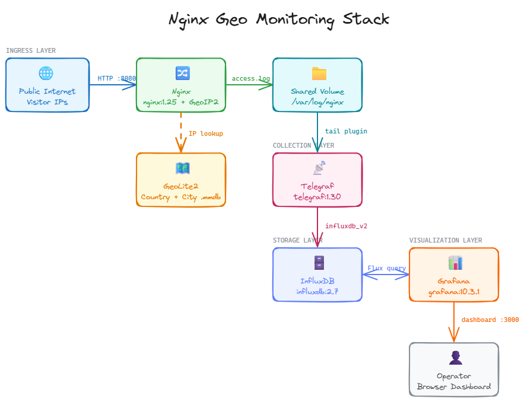

# User Access Location by Tracking IP with GeoIP
This is documentation where we would to track user location that acces webserver application, we would use [maxwind](https://www.maxmind.com/en/home) library that integrate with [nginx](https://docs.nginx.com/nginx/admin-guide/dynamic-modules/geoip/) GeoIP module.

## 1. Prequesite
- Docker installed and configured
- Docker compose installed and configured
- Maxwind account

## 2. Architecture

<p align="center">  </p>

## 3. Setup
Use docker compose to setup all these component
```sh
docker compose up -d --build
```
Make sure all container run healthy

## 4. Setting Grafana
Adding data source
- Data source : InfluxDB
    - query language : flux
    - url : http://influxdb:8086
    - basic auth : add user and password
    - organization : monitoring
    - token : supersecrettoken
    - bucket :  nginx

## 5. Create Dummy Hit Request Data
GeoIP only tracking the public ip, and for our poc we would made the random data where we can made our poc running well
```sh
chmod +x generate_logs.sh

# Inject 200 baris sekaligus (burst)
./generate_logs.sh burst 200

# Atau stream 1 baris per detik terus menerus
./generate_logs.sh stream 1

# Stream 50 baris lalu berhenti
./generate_logs.sh stream 1 50
```

## 6. References
- [Total Nginx monitoring, with application performance and a bit more, using Telegraf/InfluxDB/Grafana](https://faun.pub/total-nginx-monitoring-with-application-performance-and-a-bit-more-using-8fc6d731)
- [GeoIP documentation](https://docs.nginx.com/nginx/admin-guide/dynamic-modules/geoip/)